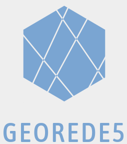

GEOREDE5 
======================================================================================================

A ideia é criar um modelo semi ubíquo paa gestão redes, quer permita:

+ localização e gestão de ativos
+ histórico e versionamento
+ simples sem ser simplificado
+ que seja fácil de escalar e/ou adaptar às necessidades específicas de cada um

Mas a ideia principal é criar um projecto de raiz, e conseguir levá-lo de :a: a :b: ... de "fio a pavio", etc...e que possa ser acompanhado nas sessões do Geocamp.

### Mais Info
* [Primeiros passos](https://github.com/georede5/inicio_pg)
* [Modelos de dados](../../../db_models)

### O que está feito?

~~Nada…~~ Pouco

### O que falta fazer?

Quase Tudo, claro está!

Para ficarem a par das novidades relativas ao projecto e/ou participarem, [podem aceder ao nosso canal de telegram](https://t.me/joinchat/IbENe1V7CyDEPbnv)
